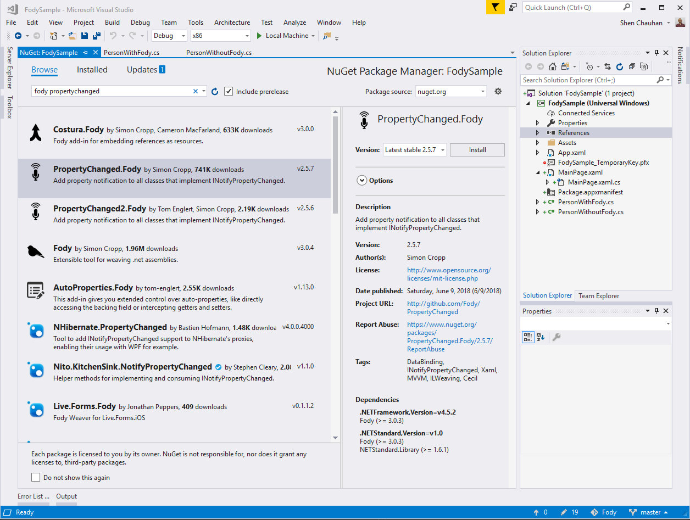
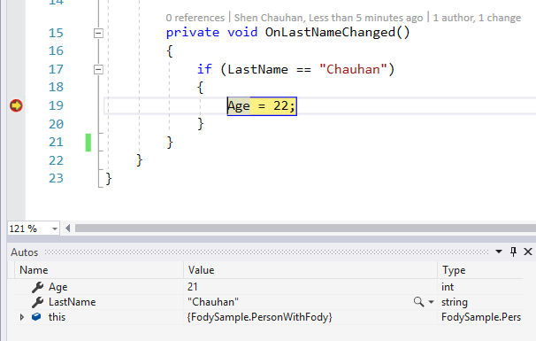
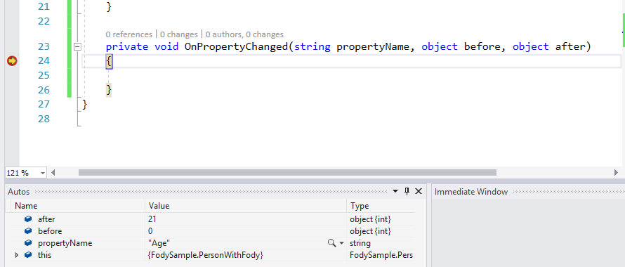

# INotifyPropertyChanged the easy way

Today I want to focus on developer productivity. One of my favourite developer libraries for XAML is Fody. What is Fody you ask? Well, to put quite simply, it's a code weaver for INotifyPropertyChanged. Anyone who has had to write a XAML based application with data binding is familiar writing code that starts like this:

```csharp
    public class PersonWithoutFody : INotifyPropertyChanged
    {
        public event PropertyChangedEventHandler PropertyChanged;

        private int _age;
        private string _firstName;
        private string _lastName;

        public string LastName
        {
            get { return _lastName; }
            set
            {
                _lastName = value;
                RaisePropertyChanged();
            }
        }


        public string FirstName
        {
            get { return _firstName; }
            set
            {
                _firstName = value;
                RaisePropertyChanged();
            }
        }


        public int Age
        {
            get { return _age; }
            set
            {
                _age = value;
                RaisePropertyChanged();
            }
        }

        private void RaisePropertyChanged([CallerMemberName]string propertyName = "")
        {
            this.PropertyChanged?.Invoke(this, new PropertyChangedEventArgs(propertyName));
        }
    }
```

There is a lot of code here that is framework code. What I would love is a simplier version which keeps my code true to what it was originally. That is where Fody comes in. The same code with Fody looks like this:

```csharp
    public class PersonWithFody : INotifyPropertyChanged
    {
        public event PropertyChangedEventHandler PropertyChanged;

        public int Age { get; set; }

        public string FirstName { get; set; }

        public string LastName { get; set; }
    }
```

The actual lines of code in the whole file reduces from 53 to 15! What is really great is that my code is clean from framework code.

Under the hood Fody weaves the eqivalence of what you see in the original file at compile time. This means you don't get  runtime performance issues.

Let's talk about how to set this up. First step is to add the nuget.
  

Next up, you need to add a FodyWeavers.xml file to your project. This helps link the code weaving to the compiler.

```xml
<?xml version="1.0" encoding="utf-8" ?>
<Weavers>
  <PropertyChanged/>
</Weavers>
```
Finally, I just need to make my sure my classes implement INotifyPropertyChanged like so:

```csharp 
public class PersonWithFody : INotifyPropertyChanged
```

And that's it!

Some of you will want to execute some logic when the setter on the property is called. Fody has a neat way for you to intercept that, you simply use a particular naming convention. For instance, if I wanted to intercept the setter on FirstName property I would write a method like so:

```csharp
    private void OnLastNameChanged()
    {
        if (LastName == "Chauhan")
        {
            Age = 22;
        }
    }
```

  

You can even subscribe for a PropertyChange globally on a class by specifying a method like:

```csharp
    private void OnPropertyChanged(string propertyName, object before, object after)
    {

    }
```
  

and sometimes you just don't want the class to use Fody, in which case you can opt-out by specifying an attribute on the class:
```csharp
    [DoNotNotify]
    public class PersonWithoutFody : INotifyPropertyChanged
```

There are a load of different options that Fody provides you, PropertyChanged is the one I used most so I wanted to share it with you all.

Happy coding!!